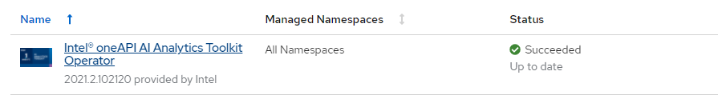
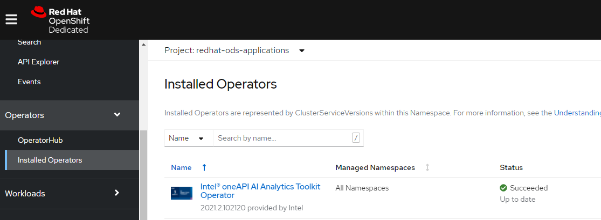

# Intel® oneAPI AI Analytics Toolkit Operator
The Operator installs and manages development tools and production AI deployments in an OpenShift cluster. It enables easy deployment and management of AI inference services by creating a `Notebook` resource.

The Operator also integrates with the JupyterHub [Spawner](https://jupyterhub.readthedocs.io/en/stable/reference/spawners.html) in [Red Hat OpenShift Data Science](https://www.redhat.com/en/technologies/cloud-computing/openshift/openshift-data-science) and [Open Data Hub](https://opendatahub.io/docs.html). See [detailed instructions](#integration-with-openshift-data-science-and-open-data-hub) below.

## Install the Operator

### Operator Installation from Red Hat Marketplace
1.	For information on registering your cluster and creating a namespace, see [Red Hat Marketplace Docs](https://marketplace.redhat.com/en-us/documentation/clusters). This must be done prior to operator install.
2.	On the main menu, click **Workspace > My Software > Intel® oneAPI AI Analytics Toolkit > Install Operator**.
3.	On the **Update Channel** section, select an option.
4.	On the **Approval Strategy** section, select either Automatic or Manual. The approval strategy corresponds to how you want to process operator upgrades.
5.	On the **Target Cluster** section:
-	Click the checkbox next to the clusters where you want to install the Operator.
-	For each cluster you selected, under **Namespace Scope**, on the **Select Scope** list, select an option.
6.	Click **Install**. It may take several minutes for installation to complete.
7.	Once installation is complete, the status will change from **installing** to **Up to date**.
8.	For further information, see the [Red Hat Marketplace Operator documentation](https://marketplace.redhat.com/en-us/documentation/operators)

### OpenShift Web Console
In the OpenShift [web console](https://docs.openshift.com/container-platform/4.7/web_console/web-console.html) navigate to OperatorHub menu. Search for "oneAPI AI" and select "Intel oneAPI AI Analytics Toolkit". Then, click the `Install` button.

## Verification of Operator Installation
1.	Once status changes to Up to date, click the vertical ellipses and select Cluster Console.
2.	Open the cluster where you installed the product
3.	Go to **Operators > Installed Operators**
4.	Select the Namespace or Project you installed on
5.	Verify status for product is **Succeeded**
6.	Click the product name to open details

## Deploy the Operator

### Prerequsite
In order to deploy the AI Kit operator, the Red Hat OpenShift Data Science operator must already be installed in the same `namespace/project` that you want to deploy the operator in. Please see the [Installing OpenShift Data Science Documentation](https://access.redhat.com/documentation/en-us/red_hat_openshift_data_science/1/html/installing_openshift_data_science/index) for more information.

### From the OpenShift Console
1. Once you have installed the Operator in OpenShift, you can manage it using the web console. Navigate to the `Installed Operators` section under `Operators` in your OpenShift Dedicated console.

2. On this page, in the top left, select the `project/namespace` that you would like to deploy the AI Kit operator in. Please ensure that the prerequisite operator "Red Hat OpenShift Data Science" is already installed in the desired `project/namespace` that you would like to deploy in before going further.

- In this case, we select `redhat-ods-applications` as our project namespace, which already has the Red Hat OpenShift Data Science operator installed.

3. From the list of installed operators, select and click on the Intel® oneAPI AI Analytics Toolkit operator. You can create a new instance under the `Details` section of the operator by clicking `Create Instance`. You can also click on the `AIKitContainer` section to view existing instances with AI Kit installed, and select `Create AIKitContainer` in the top right to accomplish the same functionality.

4.  From here, you have options to click `Create` with the default name of the AI Kit container and ImageStream for your namespace, and also rename the the container to your specifications and add any labels you would like in the relevant fields. After this is done, click `Create`.
- For further customization of the AI Kit Container metadata, including ImageStream name, please select `YAML view` and edit details there. Once this is complete, select `Create`.

5. Your operator should now be deployed in your desired namespace, as shown in the `Status` column of the `AIKitContainer` section.

## Integration with OpenShift Data Science and Open Data Hub
The Operator integrates with the JupyterHub [Spawner](https://jupyterhub.readthedocs.io/en/stable/reference/spawners.html) in [Red Hat OpenShift Data Science](https://www.redhat.com/en/technologies/cloud-computing/openshift/openshift-data-science) and [Open Data Hub](https://opendatahub.io/docs.html).

Simply create a `Notebook` resource, which deploys a JupyterLab interface containing the AI Kit developer tools and ready-to-run Jupyter notebooks. Here's how:

1. Click The `Launch` button in the web console on the `Intel® oneAPI AI Analytics Toolkit` tile of the `Enabled` section. This will build the container image and create an ImageStream.
2. This enables selecting `Intel® oneAPI AI Analytics Toolkit` image from the Jupyter Spawner `Notebook Image` menu. Select the `Intel® oneAPI AI Analytics Toolkit` image, and any other configurations for your container, then press `Start server`.
- The [`Intel® oneAPI AI Analytics Toolkit` image](https://github.com/intel-innersource/containers.orchestrators.kubernetes.operators.aikit-operator) is maintained by Intel.

Once you spawn into the Intel® oneAPI AI Analytics Toolkit image, you should be launched into a JupyterLab dashboard similar to the image below. There is a `Welcome.ipynb` notebook as well as ready-to-run Jupyter notebook samples to help you get started.

