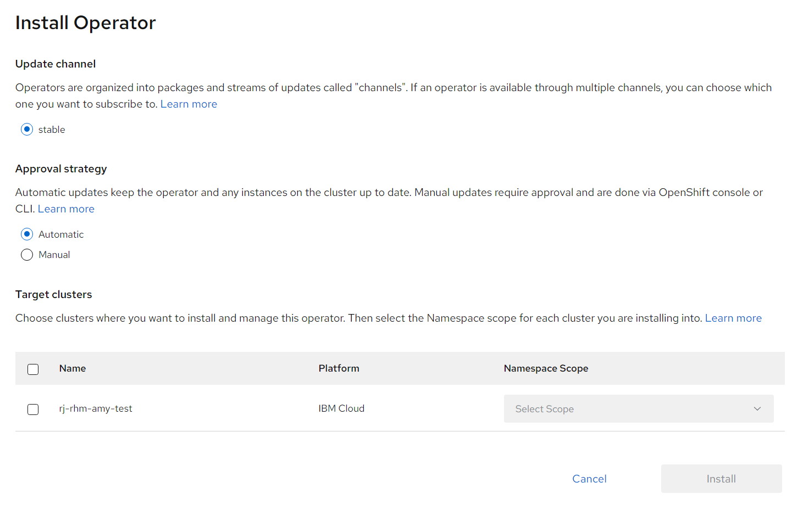
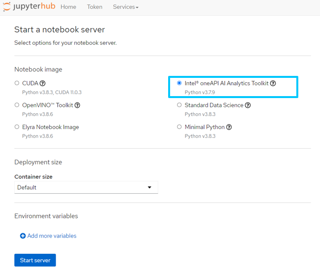
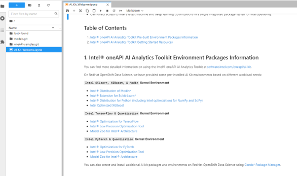

# Intel® oneAPI AI Analytics Toolkit Operator
The Operator installs and manages development tools and production AI deployments in an OpenShift cluster. It enables easy deployment and management of AI inference services by creating a `Notebook` resource.

The Operator also integrates with the JupyterHub [Spawner](https://jupyterhub.readthedocs.io/en/stable/reference/spawners.html) in [Red Hat OpenShift Data Science](https://www.redhat.com/en/technologies/cloud-computing/openshift/openshift-data-science) and [Open Data Hub](https://opendatahub.io/docs.html). See [detailed instructions](#integration-with-openshift-data-science-and-open-data-hub) below.

## Install the Operator

### Operator Installation from RedHat Marketplace
1.	For information on registering your cluster and creating a namespace, see [Red Hat Marketplace Docs](https://marketplace.redhat.com/en-us/documentation/clusters). This must be done prior to operator install.
2.	On the main menu, click **Workspace > My Software > Intel® oneAPI AI Analytics Toolkit > Install Operator**.
3.	On the **Update Channel** section, select an option.
4.	On the **Approval Strategy** section, select either Automatic or Manual. The approval strategy corresponds to how you want to process operator upgrades.
5.	On the **Target Cluster** section:
-	Click the checkbox next to the clusters where you want to install the Operator.
-	For each cluster you selected, under **Namespace Scope**, on the **Select Scope** list, select an option.
6.	Click **Install**. It may take several minutes for installation to complete.
7.	Once installation is complete, the status will change from **installing** to **Up to date**.
8.	For further information, see the [Red Hat Marketplace Operator documentation](https://marketplace.redhat.com/en-us/documentation/operators)

### OpenShift Web Console
In the OpenShift [web console](https://docs.openshift.com/container-platform/4.7/web_console/web-console.html) navigate to OperatorHub menu. Search for "oneAPI AI" and select "Intel oneAPI AI Analytics Toolkit". Then, click the `Install` button.

## Verification of Operator Installation
1.	Once status changes to Up to date, click the vertical ellipses and select Cluster Console.
2.	Open the cluster where you installed the product
3.	Go to **Operators > Installed Operators**
4.	Select the Namespace or Project you installed on
5.	Verify status for product is **Succeeded**
6.	Click the product name to open details

## Deploy the Operator

### From the OpenShift Console
Once you have installed the Operator in OpenShift, you can manage it using the web console.

From the web console, ensure the project(namespace) `redhat-ods-applications` exists, otherwise create that project and select it.
Then navigate to `Installed Operators -> Intel® oneAPI AI Analytics Toolkit Operator` and from `AiKitContainer` tab, click `Create AIKitContainer`.

## Integration with OpenShift Data Science and Open Data Hub
The Operator integrates with the JupyterHub [Spawner](https://jupyterhub.readthedocs.io/en/stable/reference/spawners.html) in [Red Hat OpenShift Data Science](https://www.redhat.com/en/technologies/cloud-computing/openshift/openshift-data-science) and [Open Data Hub](https://opendatahub.io/docs.html). Simply create a `Notebook` resource, which deploys a JupyterLab interface containing the AI Kit developer tools and ready-to-run Jupyter notebooks.

The `Create AIKitContainer` button in the web console will build the container image and create an ImageStream. This enables selecting `Intel oneAPI AI Analytics Toolkit` image from the Jupyter Spawner `Notebook Image` menu. The [image](https://github.com/IntelAI/aikit-operator) is maintained by Intel.

Once you spawn into the Intel® oneAPI AI Analytics Toolkit image, you should be launched into a JupyterLab dashboard similar to the image below. There is a `Welcome` notebook as well as ready-to-run Jupyter notebook samples to help you get started.

=======
# Intel® oneAPI AI Analytics Toolkit Operator
The Operator installs and manages development tools and production AI deployments in an OpenShift cluster. It enables easy deployment and management of AI inference services by creating a `Notebook` resource.

The Operator also integrates with the JupyterHub [Spawner](https://jupyterhub.readthedocs.io/en/stable/reference/spawners.html) in [Red Hat OpenShift Data Science](https://www.redhat.com/en/technologies/cloud-computing/openshift/openshift-data-science) and [Open Data Hub](https://opendatahub.io/docs.html). See [detailed instructions](#integration-with-openshift-data-science-and-open-data-hub) below.

## Install the Operator

### Operator Installation from RedHat Marketplace
1.	For information on registering your cluster and creating a namespace, see [Red Hat Marketplace Docs](https://marketplace.redhat.com/en-us/documentation/clusters). This must be done prior to operator install.
2.	On the main menu, click **Workspace > My Software > Intel® oneAPI AI Analytics Toolkit > Install Operator**.
3.	On the **Update Channel** section, select an option.
4.	On the **Approval Strategy** section, select either Automatic or Manual. The approval strategy corresponds to how you want to process operator upgrades.
5.	On the **Target Cluster** section:
-	Click the checkbox next to the clusters where you want to install the Operator.
-	For each cluster you selected, under **Namespace Scope**, on the **Select Scope** list, select an option.
6.	Click **Install**. It may take several minutes for installation to complete.
7.	Once installation is complete, the status will change from **installing** to **Up to date**.
8.	For further information, see the [Red Hat Marketplace Operator documentation](https://marketplace.redhat.com/en-us/documentation/operators)

### OpenShift Web Console
In the OpenShift [web console](https://docs.openshift.com/container-platform/4.7/web_console/web-console.html) navigate to OperatorHub menu. Search for "oneAPI AI" and select "Intel oneAPI AI Analytics Toolkit". Then, click the `Install` button.

## Verification of Operator Installation
1.	Once status changes to Up to date, click the vertical ellipses and select Cluster Console.
2.	Open the cluster where you installed the product
3.	Go to **Operators > Installed Operators**
4.	Select the Namespace or Project you installed on
5.	Verify status for product is **Succeeded**
6.	Click the product name to open details

## Deploy the Operator

### From the OpenShift Console

Once you have installed the Operator in OpenShift, you can manage it using the web console. Navigate to `Installed Operators` and click `Create Notebook`.

## Integration with OpenShift Data Science and Open Data Hub

The Operator integrates with the JupyterHub [Spawner](https://jupyterhub.readthedocs.io/en/stable/reference/spawners.html) in [Red Hat OpenShift Data Science](https://www.redhat.com/en/technologies/cloud-computing/openshift/openshift-data-science) and [Open Data Hub](https://opendatahub.io/docs.html). Simply create a `Notebook` resource, which deploys a JupyterLab interface containing the AI Kit developer tools and ready-to-run Jupyter notebooks.

The `Create Notebook` button in the web console will build the container image and create an ImageStream. This enables selecting `Intel oneAPI AI Analytics Toolkit` image from the Jupyter Spawner `Notebook Image` menu. The [image](https://github.com/IntelAI/aikit-operator) is maintained by Intel.

Once you spawn into the Intel® oneAPI AI Analytics Toolkit image, you should be launched into a JupyterLab dashboard similar to the image below. There is a `Welcome` notebook as well as ready-to-run Jupyter notebook samples to help you get started.

